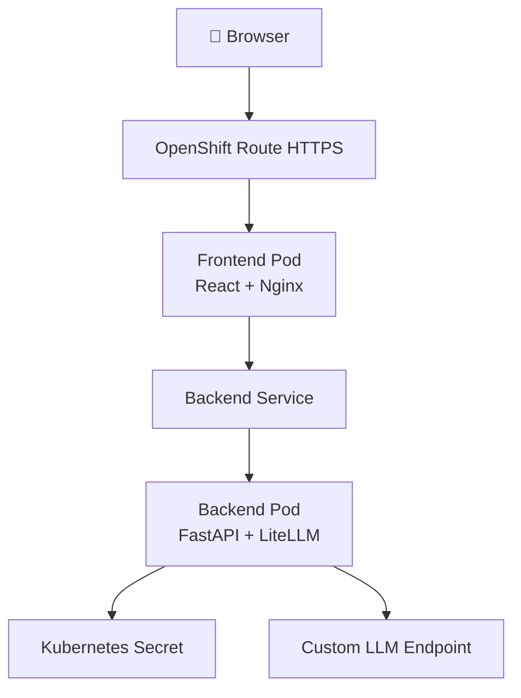

# LiteLLM OpenShift POC

A hands-on learning project to understand OpenShift, Kubernetes, and GitOps with ArgoCD by building a simple chat application powered by LiteLLM.

## What You'll Learn

- **Kubernetes Fundamentals:** Pods, Services, Deployments, Routes, Secrets
- **OpenShift Specifics:** Routes, Projects, OpenShift CLI (`oc`)
- **GitOps with ArgoCD:** Automated deployments from Git
- **Container Orchestration:** Multi-container applications
- **Progressive Learning:** Manual deployment → GitOps automation

## Architecture



## Tech Stack

- **Backend:** Python 3.11, FastAPI, LiteLLM
- **Frontend:** React 18, Nginx
- **Container Registry:** Docker Hub
- **Platform:** OpenShift (Red Hat Developer Sandbox)
- **GitOps:** ArgoCD

## Prerequisites

- [Docker Desktop](https://www.docker.com/products/docker-desktop/)
- [OpenShift CLI (`oc`)](https://docs.openshift.com/container-platform/latest/cli_reference/openshift_cli/getting-started-cli.html)
- [Docker Hub Account](https://hub.docker.com/)
- [Red Hat Developer Sandbox](https://developers.redhat.com/developer-sandbox) (free OpenShift cluster)
- Custom OpenAI-compatible LLM endpoint + API key

## Quick Start

### Phase 1: Manual Deployment

1. **Clone and setup**
   ```bash
   git clone https://github.com/YOUR_USERNAME/litellm-openshift-poc.git
   cd litellm-openshift-poc
   ```

2. **Build images**
   ```bash
   ./scripts/build.sh
   # Enter your Docker Hub username when prompted
   ```

3. **Push images**
   ```bash
   ./scripts/push.sh
   # Login to Docker Hub if needed
   ```

4. **Update Kubernetes manifests**
   ```bash
   # Edit k8s/backend-deployment.yaml and k8s/frontend-deployment.yaml
   # Replace YOUR_DOCKERHUB_USERNAME with your actual username
   ```

5. **Create secret**
   ```bash
   cp k8s/secret.yaml.template k8s/secret.yaml
   # Edit k8s/secret.yaml with your LLM credentials
   ```

6. **Deploy to OpenShift**
   ```bash
   oc login --token=YOUR_TOKEN --server=YOUR_SERVER
   oc apply -f k8s/
   ```

7. **Access application**
   ```bash
   oc get route frontend-route -o jsonpath='{.spec.host}'
   # Open the URL in your browser
   ```

### Phase 2: ArgoCD GitOps

See [`argocd/README.md`](argocd/README.md) for detailed ArgoCD setup.

## Project Structure

```
.
├── backend/              # FastAPI + LiteLLM backend
│   ├── app.py
│   ├── requirements.txt
│   └── Dockerfile
├── frontend/             # React chat UI
│   ├── src/
│   ├── public/
│   ├── package.json
│   └── Dockerfile
├── k8s/                  # Kubernetes manifests
│   ├── backend-deployment.yaml
│   ├── backend-service.yaml
│   ├── frontend-deployment.yaml
│   ├── frontend-service.yaml
│   ├── frontend-route.yaml
│   └── secret.yaml.template
├── argocd/              # ArgoCD configuration
│   └── application.yaml
├── scripts/             # Build and deployment scripts
│   ├── build.sh
│   └── push.sh
└── docs/                # Documentation
    ├── plans/
    ├── DEPLOYMENT.md
    └── TROUBLESHOOTING.md
```

## Documentation

- [Design Document](docs/plans/2026-02-17-litellm-openshift-argocd-poc-design.md)
- [Deployment Guide](docs/DEPLOYMENT.md)
- [Troubleshooting](docs/TROUBLESHOOTING.md)

## Learning Checkpoints

### After Phase 1
- ✅ Understand Pods, Services, Deployments
- ✅ Know how Secrets inject environment variables
- ✅ Understand OpenShift Routes vs Kubernetes Ingress
- ✅ Can read logs with `oc logs`
- ✅ Understand container-to-container communication

### After Phase 2
- ✅ Understand GitOps principles
- ✅ Know how ArgoCD monitors Git repositories
- ✅ Can trigger deployments via Git commits
- ✅ Understand declarative vs imperative deployments
- ✅ Can rollback using Git revert

## Common Commands

```bash
# View pods
oc get pods

# View logs
oc logs -f deployment/backend

# Describe resources
oc describe pod <pod-name>

# Get route URL
oc get route frontend-route

# Delete all resources
oc delete -f k8s/
```

## Contributing

This is a personal learning project, but feel free to fork and adapt for your own learning!

## License

MIT

## Acknowledgments

Built with guidance from Claude Code as a hands-on learning project for understanding OpenShift and GitOps workflows.
