# LiteLLM OpenShift POC

A hands-on learning project to understand OpenShift, Kubernetes, and GitOps with ArgoCD by building a simple chat application powered by LiteLLM.

## What You'll Learn

- **Kubernetes Fundamentals:** Pods, Services, Deployments, Routes, Secrets ✅
- **OpenShift Specifics:** Routes, Projects, OpenShift CLI (`oc`) ✅
- **Container Orchestration:** Multi-container applications ✅
- **Docker Multi-architecture Builds:** Building for different platforms (ARM64 vs AMD64) ✅
- **GitOps with ArgoCD:** Automated deployments from Git 📚 (requires cluster-admin)
- **Progressive Learning:** Manual deployment → GitOps automation 📚

## Architecture

```mermaid
graph TB
    User[👤 Browser] --> Route[OpenShift Route HTTPS]
    Route --> Frontend[Frontend Pod<br/>React + Nginx]
    Frontend --> BackendSvc[Backend Service]
    BackendSvc --> Backend[Backend Pod<br/>FastAPI + LiteLLM]
    Backend --> Secret[Kubernetes Secret]
    Backend --> LLM[Custom LLM Endpoint]
```



## Tech Stack

- **Backend:** Python 3.11, FastAPI, LiteLLM
- **Frontend:** React 18, Nginx
- **Container Registry:** Docker Hub
- **Platform:** OpenShift (Red Hat Developer Sandbox)
- **GitOps:** ArgoCD

## Prerequisites

- [Docker Desktop](https://www.docker.com/products/docker-desktop/)
- [OpenShift CLI (`oc`)](https://docs.openshift.com/container-platform/latest/cli_reference/openshift_cli/getting-started-cli.html)
- [Docker Hub Account](https://hub.docker.com/)
- [Red Hat Developer Sandbox](https://developers.redhat.com/developer-sandbox) (free OpenShift cluster)
- Custom OpenAI-compatible LLM endpoint + API key

## Quick Start

### Phase 1: Manual Deployment

1. **Clone and setup**
   ```bash
   git clone https://github.com/carherpi/litellm-openshift-poc.git
   cd litellm-openshift-poc
   ```

2. **Create credentials file**
   ```bash
   cp .env.template .env
   # Edit .env with your LLM API credentials
   ```

3. **Login to OpenShift**
   ```bash
   oc login --token=YOUR_TOKEN --server=YOUR_SERVER
   # Get token from Red Hat Developer Sandbox
   ```

4. **Build, push, and deploy (one command)**
   ```bash
   ./scripts/redeploy.sh
   # This builds images, pushes to Docker Hub, and deploys to OpenShift
   # Enter your Docker Hub username when prompted (default: carlosmw)
   # Enter version tag when prompted (default: latest version)
   ```

5. **Access application**
   ```bash
   oc get route frontend-route -o jsonpath='{.spec.host}'
   # Open the URL in your browser
   ```

### Phase 1 Complete! ✅

Your application is now running on OpenShift. You can access it at:
```bash
oc get route frontend-route -o jsonpath='{.spec.host}'
```

## Next Steps

### ArgoCD GitOps (Phase 2)

**Prerequisites:** Cluster-admin permissions (not available in Red Hat Developer Sandbox)

ArgoCD automates deployments by monitoring your Git repository and keeping your cluster in sync with your `k8s/` manifests. This eliminates manual `oc apply` commands and enables true GitOps workflows.

**To explore ArgoCD, you'll need:**
- A local Kubernetes cluster (kind, minikube, or Docker Desktop) with full admin rights, OR
- A different OpenShift environment where you have cluster-admin permissions

**What you'll learn:**
- GitOps principles (Git as single source of truth)
- Automated deployments from Git commits
- Drift detection and self-healing
- Visual application topology in ArgoCD UI
- Declarative infrastructure management

See [`argocd/README.md`](argocd/README.md) for installation instructions when you have the required permissions.

### Other Learning Opportunities

**With your current sandbox access:**
- ConfigMaps for application configuration
- Horizontal Pod Autoscaling (HPA)
- Rolling updates and rollback strategies
- Resource quotas and limits
- Multi-replica deployments and load balancing
- Liveness and readiness probes tuning
- OpenShift monitoring and metrics

## Project Structure

```
.
├── backend/              # FastAPI + LiteLLM backend
│   ├── app.py
│   ├── requirements.txt
│   └── Dockerfile
├── frontend/             # React chat UI
│   ├── src/
│   ├── public/
│   ├── package.json
│   └── Dockerfile
├── k8s/                  # Kubernetes manifests
│   ├── backend-deployment.yaml
│   ├── backend-service.yaml
│   ├── frontend-deployment.yaml
│   ├── frontend-service.yaml
│   ├── frontend-route.yaml
│   └── secret.yaml.template
├── argocd/              # ArgoCD configuration
│   └── application.yaml
├── scripts/             # Build and deployment scripts
│   ├── build.sh
│   └── push.sh
└── docs/                # Documentation
    ├── plans/
    ├── DEPLOYMENT.md
    └── TROUBLESHOOTING.md
```

## Documentation

- [Design Document](docs/plans/2026-02-17-litellm-openshift-argocd-poc-design.md)
- [Deployment Guide](docs/DEPLOYMENT.md)
- [Troubleshooting](docs/TROUBLESHOOTING.md)

## Learning Checkpoints

### After Phase 1
- ✅ Understand Pods, Services, Deployments
- ✅ Know how Secrets inject environment variables
- ✅ Understand OpenShift Routes vs Kubernetes Ingress
- ✅ Can read logs with `oc logs`
- ✅ Understand container-to-container communication

### After Phase 2 (ArgoCD - Future Learning)
- 📚 Understand GitOps principles
- 📚 Know how ArgoCD monitors Git repositories
- 📚 Can trigger deployments via Git commits
- 📚 Understand declarative vs imperative deployments
- 📚 Can rollback using Git revert

**Note:** Phase 2 requires cluster-admin permissions. See "Next Steps" section above.

## Common Commands

```bash
# View pods
oc get pods

# View logs
oc logs -f deployment/backend

# Describe resources
oc describe pod <pod-name>

# Get route URL
oc get route frontend-route

# Delete all resources
oc delete -f k8s/
```

## Contributing

This is a personal learning project, but feel free to fork and adapt for your own learning!

## License

MIT

## Acknowledgments

Built with guidance from Claude Code as a hands-on learning project for understanding OpenShift and GitOps workflows.
