# LiteLLM + OpenShift + ArgoCD POC - Design Document

**Date:** 2026-02-17
**Purpose:** Learning project to understand OpenShift, Kubernetes, and GitOps with ArgoCD
**Approach:** Progressive learning - manual deployment first, then GitOps automation

## Overview

A simple chat application using LiteLLM to interact with a custom OpenAI-compatible LLM endpoint, deployed on OpenShift with ArgoCD for GitOps automation.

## Goals

- Understand OpenShift/Kubernetes fundamentals (pods, services, deployments, routes)
- Learn GitOps workflow with ArgoCD
- Experience both manual and automated deployment patterns
- Build practical knowledge through a working chat application

## Architecture

```mermaid
graph TB
    subgraph External["External"]
        User["👤 You (Browser)"]
        DockerHub["🐳 Docker Hub<br/>(Container Images)"]
        CustomLLM["☁️ Your Custom LLM<br/>(OpenAI-compatible API)"]
    end

    subgraph OpenShift["OpenShift Cluster"]
        Route["🌐 Route<br/>(Public HTTPS URL)"]

        subgraph Frontend["Frontend Namespace"]
            FrontendService["Frontend Service<br/>(ClusterIP:80)"]
            FrontendPod["Frontend Pod<br/>React + Nginx"]
        end

        subgraph Backend["Backend Namespace"]
            BackendService["Backend Service<br/>(ClusterIP:8000)"]
            BackendPod["Backend Pod<br/>FastAPI + LiteLLM"]
        end

        Secret["🔐 Secret<br/>(API Key + Endpoint URL)"]
    end

    User -->|"1. Access chat UI"| Route
    Route -->|"2. HTTPS"| FrontendService
    FrontendService --> FrontendPod
    FrontendPod -->|"3. POST /chat"| BackendService
    BackendService --> BackendPod
    BackendPod -.->|"4. Read env vars"| Secret
    BackendPod -->|"5. LiteLLM API call"| CustomLLM
    CustomLLM -.->|"6. Response"| BackendPod
    BackendPod -.->|"7. JSON response"| FrontendPod
    FrontendPod -.->|"8. Display"| User

    DockerHub -.->|"Pull images"| FrontendPod
    DockerHub -.->|"Pull images"| BackendPod
```



## Repository Structure

```
litellm-openshift-poc/
├── backend/              # Python FastAPI + LiteLLM
│   ├── app.py
│   ├── requirements.txt
│   └── Dockerfile
├── frontend/             # React chat UI
│   ├── src/
│   ├── public/
│   ├── package.json
│   └── Dockerfile
├── k8s/                  # Kubernetes manifests
│   ├── backend-deployment.yaml
│   ├── backend-service.yaml
│   ├── frontend-deployment.yaml
│   ├── frontend-service.yaml
│   ├── frontend-route.yaml
│   └── secret.yaml
├── argocd/              # ArgoCD configuration (Phase 2)
│   └── application.yaml
└── docs/
    └── plans/
        └── this-file.md
```

## Components

### 1. Backend (FastAPI + LiteLLM)

**Technology Stack:**
- Python 3.11
- FastAPI (web framework)
- LiteLLM (unified LLM API client)
- Uvicorn (ASGI server)

**Functionality:**
- Single `/chat` POST endpoint
- Accepts JSON: `{ "message": "user input" }`
- Returns JSON: `{ "response": "LLM output" }`
- CORS enabled for frontend communication
- Reads configuration from environment variables

**Environment Variables:**
- `LLM_API_BASE`: Custom LLM endpoint URL
- `LLM_API_KEY`: API authentication key
- `LLM_MODEL`: Model name to use

**Container:**
- Base: Python 3.11 Alpine
- Exposed port: 8000
- Health check: GET `/health`

### 2. Frontend (React + Nginx)

**Technology Stack:**
- React 18
- Simple CSS styling
- Nginx (production web server)

**Functionality:**
- Text input for chat messages
- Display chat history (user messages + LLM responses)
- Loading indicator while waiting for responses
- Error handling for backend unavailability
- Calls backend via `http://backend-service:8000/chat`

**Components:**
```
App.js
├── ChatContainer
│   ├── MessageList (displays conversation)
│   └── MessageInput (input box + send button)
```

**Container:**
- Multi-stage build:
  1. Build stage: Node.js to compile React app
  2. Production stage: Nginx to serve static files
- Exposed port: 80
- Nginx proxies API calls to backend service

### 3. Kubernetes Resources

#### Secret
- Name: `litellm-secrets`
- Type: Opaque
- Data:
  - `LLM_API_BASE`: base64 encoded endpoint URL
  - `LLM_API_KEY`: base64 encoded API key

#### Backend Deployment
- Name: `backend`
- Replicas: 1 (sufficient for POC)
- Container: `yourdockerhub/litellm-backend:latest`
- Port: 8000
- Environment variables from Secret
- Resource limits:
  - Memory: 256Mi
  - CPU: 0.5

#### Backend Service
- Name: `backend-service`
- Type: ClusterIP (internal only)
- Port: 8000
- Selector: `app=backend`

#### Frontend Deployment
- Name: `frontend`
- Replicas: 1
- Container: `yourdockerhub/litellm-frontend:latest`
- Port: 80
- Resource limits:
  - Memory: 128Mi
  - CPU: 0.25

#### Frontend Service
- Name: `frontend-service`
- Type: ClusterIP
- Port: 80
- Selector: `app=frontend`

#### Frontend Route (OpenShift)
- Name: `frontend-route`
- Target: `frontend-service:80`
- TLS: Edge termination (automatic HTTPS)
- Generates public URL: `https://litellm-chat-<namespace>.apps.<cluster-domain>`

## Implementation Approach

### Phase 1: Manual Deployment (Learn the Fundamentals)

**Goal:** Understand each Kubernetes component by deploying manually

**Steps:**
1. Build Docker images locally
2. Push images to Docker Hub
3. Create Kubernetes Secret with credentials
4. Apply manifests using `oc apply -f k8s/`
5. Verify pods are running
6. Access via Route URL
7. Test the chat functionality

**Learning Outcomes:**
- How pods, services, and routes work together
- How Secrets inject environment variables
- How OpenShift Routes expose services
- How to troubleshoot with `oc logs` and `oc describe`
- Container-to-container communication via service names

### Phase 2: GitOps with ArgoCD (Automation)

**Goal:** Automate deployments using Git as the source of truth

**Setup:**
1. Install ArgoCD on OpenShift cluster
2. Create ArgoCD Application resource
3. Point Application to Git repo `/k8s` folder
4. Enable auto-sync and self-healing

**ArgoCD Application Configuration:**
```yaml
apiVersion: argoproj.io/v1alpha1
kind: Application
metadata:
  name: litellm-chat
  namespace: argocd
spec:
  project: default
  source:
    repoURL: https://github.com/<username>/litellm-openshift-poc
    path: k8s
    targetRevision: main
  destination:
    server: https://kubernetes.default.svc
    namespace: <your-namespace>
  syncPolicy:
    automated:
      prune: true      # Delete resources removed from Git
      selfHeal: true   # Auto-correct manual changes
    syncOptions:
      - CreateNamespace=false
```

**GitOps Workflow:**
1. Edit Kubernetes manifests locally
2. Commit changes to Git
3. Push to GitHub
4. ArgoCD detects changes (polls every ~3 minutes)
5. ArgoCD applies changes to cluster
6. Verify deployment in ArgoCD UI

**Learning Outcomes:**
- GitOps principles (Git as single source of truth)
- Declarative infrastructure management
- Automated deployment pipelines
- Drift detection and reconciliation
- How to use ArgoCD UI and CLI

## Deployment Flow

### Initial Setup (One-time)
1. Sign up for Red Hat Developer Sandbox (free OpenShift cluster)
2. Install `oc` CLI tool
3. Login to OpenShift cluster: `oc login --token=<token> --server=<url>`
4. Create Docker Hub account
5. Login to Docker Hub: `docker login`

### Phase 1 Deployment
1. Build backend: `docker build -t <username>/litellm-backend:v1 ./backend`
2. Build frontend: `docker build -t <username>/litellm-frontend:v1 ./frontend`
3. Push images: `docker push <username>/litellm-backend:v1`
4. Create secret: `oc apply -f k8s/secret.yaml`
5. Deploy: `oc apply -f k8s/`
6. Wait for pods: `oc get pods -w`
7. Get URL: `oc get route frontend-route`
8. Test application

### Phase 2 Deployment
1. Install ArgoCD: `oc apply -n argocd -f https://raw.githubusercontent.com/argoproj/argo-cd/stable/manifests/install.yaml`
2. Expose ArgoCD UI: `oc -n argocd expose svc argocd-server`
3. Get admin password: `oc -n argocd get secret argocd-initial-admin-secret -o jsonpath="{.data.password}" | base64 -d`
4. Create Application: `oc apply -f argocd/application.yaml`
5. Make changes to `k8s/` manifests
6. Commit and push to Git
7. Watch ArgoCD sync automatically

## API Contract

### POST /chat

**Request:**
```json
{
  "message": "Hello, how are you?"
}
```

**Response (Success):**
```json
{
  "response": "I'm doing well, thank you! How can I help you today?"
}
```

**Response (Error):**
```json
{
  "error": "Failed to connect to LLM endpoint"
}
```

**Status Codes:**
- 200: Success
- 400: Invalid request
- 500: Internal server error (LLM API failure)

## Configuration

### Backend Environment Variables
- `LLM_API_BASE`: Base URL for custom LLM endpoint (e.g., `https://api.example.com/v1`)
- `LLM_API_KEY`: API key for authentication
- `LLM_MODEL`: Model identifier (e.g., `gpt-3.5-turbo`)

### Frontend Environment Variables
- `REACT_APP_BACKEND_URL`: Backend service URL (set to `http://backend-service:8000` in production)

## Security Considerations

1. **Secrets Management:**
   - API keys stored in Kubernetes Secrets (base64 encoded)
   - Never commit secrets to Git
   - Use `.gitignore` to exclude `secret.yaml` with actual values

2. **Network Security:**
   - Backend not exposed externally (ClusterIP only)
   - Frontend Route uses TLS/HTTPS
   - CORS configured to only accept requests from frontend domain

3. **Container Security:**
   - Non-root user in containers
   - Minimal base images (Alpine)
   - No unnecessary packages

## Scaling Considerations (Future Learning)

While this POC uses 1 replica per service, future experiments could explore:

1. **Horizontal Pod Autoscaling (HPA):**
   - Scale pods based on CPU/memory usage
   - Learn how Kubernetes handles load balancing

2. **Multiple Replicas:**
   - Change `replicas: 1` to `replicas: 3`
   - Observe how Services distribute traffic
   - Experience zero-downtime rolling updates

3. **Resource Quotas:**
   - Set namespace limits
   - Understand resource management in multi-tenant clusters

## Troubleshooting Commands

```bash
# View pods
oc get pods

# View logs
oc logs <pod-name>

# Describe resource
oc describe pod <pod-name>

# Get routes
oc get routes

# Port forward for local testing
oc port-forward svc/backend-service 8000:8000

# View ArgoCD applications
oc get applications -n argocd

# View events
oc get events --sort-by='.lastTimestamp'
```

## Success Criteria

**Phase 1 Complete When:**
- Both containers build successfully
- Images pushed to Docker Hub
- Pods running and healthy
- Frontend accessible via Route URL
- Chat sends messages and receives LLM responses
- Understanding of all Kubernetes resources created

**Phase 2 Complete When:**
- ArgoCD installed and accessible
- Application syncing from Git
- Git commit triggers automatic redeployment
- Understanding of GitOps workflow
- Can make changes via Git instead of `oc apply`

## Learning Checkpoints

After Phase 1, you should be able to answer:
- What is a Pod? A Service? A Route?
- How do containers communicate within a cluster?
- How are Secrets injected into containers?
- What happens when you delete a Pod?
- How does OpenShift differ from vanilla Kubernetes?

After Phase 2, you should be able to answer:
- What is GitOps?
- How does ArgoCD detect changes?
- What is declarative vs imperative deployment?
- What happens if you manually edit a resource in the cluster?
- How would you rollback a deployment using Git?

## Resources

- [OpenShift Documentation](https://docs.openshift.com/)
- [ArgoCD Documentation](https://argo-cd.readthedocs.io/)
- [LiteLLM Documentation](https://docs.litellm.ai/)
- [Kubernetes Concepts](https://kubernetes.io/docs/concepts/)
- [Red Hat Developer Sandbox](https://developers.redhat.com/developer-sandbox)

## Next Steps

After this design is approved:
1. Create detailed implementation plan
2. Set up project repository structure
3. Build backend application
4. Build frontend application
5. Create Kubernetes manifests
6. Deploy Phase 1 (manual)
7. Install and configure ArgoCD
8. Deploy Phase 2 (GitOps)
