# LiteLLM + OpenShift + ArgoCD POC Implementation Plan

> **For Claude:** REQUIRED SUB-SKILL: Use superpowers:executing-plans to implement this plan task-by-task.

**Goal:** Build a working chat application with LiteLLM backend and React frontend, deployed to OpenShift, then automated with ArgoCD.

**Architecture:** Monorepo with separate backend (FastAPI + LiteLLM) and frontend (React + Nginx) containers. Manual deployment first to understand Kubernetes resources, then ArgoCD for GitOps automation.

**Tech Stack:** Python 3.11, FastAPI, LiteLLM, React 18, Docker, OpenShift, ArgoCD

---

## Phase 1: Project Setup

### Task 1: Initialize Project Structure

**Files:**
- Create: `backend/.gitkeep`
- Create: `frontend/.gitkeep`
- Create: `k8s/.gitkeep`
- Create: `argocd/.gitkeep`
- Create: `.gitignore`
- Create: `README.md`

**Step 1: Create directory structure**

```bash
mkdir -p backend frontend k8s argocd
touch backend/.gitkeep frontend/.gitkeep k8s/.gitkeep argocd/.gitkeep
```

**Step 2: Create .gitignore**

```gitignore
# Python
__pycache__/
*.py[cod]
*$py.class
*.so
.Python
venv/
env/
.venv

# Node
node_modules/
npm-debug.log*
yarn-debug.log*
yarn-error.log*
build/
.DS_Store

# IDEs
.vscode/
.idea/
*.swp
*.swo

# Secrets (IMPORTANT)
k8s/secret.yaml
.env
*.key
*.pem

# Docker
.dockerignore
```

**Step 3: Create README**

```markdown
# LiteLLM OpenShift POC

A learning project to understand OpenShift, Kubernetes, and ArgoCD GitOps workflows.

## Architecture

- **Backend:** FastAPI + LiteLLM (Python)
- **Frontend:** React + Nginx
- **Deployment:** OpenShift with ArgoCD

## Prerequisites

- Docker Desktop
- OpenShift CLI (`oc`)
- Red Hat Developer Sandbox account
- Docker Hub account

## Documentation

See `docs/plans/` for design and implementation details.

## Quick Start

### Phase 1: Manual Deployment
1. Build images: `./scripts/build.sh`
2. Push images: `./scripts/push.sh`
3. Deploy: `oc apply -f k8s/`

### Phase 2: ArgoCD GitOps
1. Install ArgoCD
2. Apply ArgoCD app: `oc apply -f argocd/application.yaml`
3. Push changes to Git and watch auto-deployment
```

**Step 4: Commit project structure**

```bash
git add .
git commit -m "chore: initialize project structure

- Add backend, frontend, k8s, argocd directories
- Add .gitignore with secrets exclusion
- Add README with quick start guide

Co-Authored-By: Claude Opus 4.6 <noreply@anthropic.com>"
```

---

## Phase 2: Backend Implementation

### Task 2: Backend Application Code

**Files:**
- Create: `backend/app.py`
- Create: `backend/requirements.txt`
- Create: `backend/.dockerignore`

**Step 1: Create requirements.txt**

```txt
fastapi==0.109.0
uvicorn[standard]==0.27.0
litellm==1.17.0
python-dotenv==1.0.0
```

**Step 2: Create .dockerignore**

```
__pycache__
*.pyc
*.pyo
*.pyd
.Python
venv/
.env
.git
.gitignore
README.md
```

**Step 3: Create app.py with backend logic**

```python
from fastapi import FastAPI, HTTPException
from fastapi.middleware.cors import CORSMiddleware
from pydantic import BaseModel
import litellm
import os
from typing import Optional

app = FastAPI(title="LiteLLM Chat Backend")

# CORS configuration
app.add_middleware(
    CORSMiddleware,
    allow_origins=["*"],  # In production, specify frontend domain
    allow_credentials=True,
    allow_methods=["*"],
    allow_headers=["*"],
)

# Configuration from environment variables
LLM_API_BASE = os.getenv("LLM_API_BASE", "")
LLM_API_KEY = os.getenv("LLM_API_KEY", "")
LLM_MODEL = os.getenv("LLM_MODEL", "gpt-3.5-turbo")

# Configure LiteLLM
if LLM_API_BASE:
    litellm.api_base = LLM_API_BASE

class ChatRequest(BaseModel):
    message: str

class ChatResponse(BaseModel):
    response: str

class ErrorResponse(BaseModel):
    error: str

@app.get("/health")
async def health_check():
    """Health check endpoint for Kubernetes."""
    return {"status": "healthy"}

@app.post("/chat", response_model=ChatResponse)
async def chat(request: ChatRequest):
    """
    Chat endpoint that forwards messages to LLM via LiteLLM.
    """
    try:
        if not request.message.strip():
            raise HTTPException(status_code=400, detail="Message cannot be empty")

        # Call LLM via LiteLLM
        response = litellm.completion(
            model=LLM_MODEL,
            messages=[
                {"role": "user", "content": request.message}
            ],
            api_key=LLM_API_KEY,
            api_base=LLM_API_BASE if LLM_API_BASE else None
        )

        # Extract response text
        assistant_message = response.choices[0].message.content

        return ChatResponse(response=assistant_message)

    except Exception as e:
        print(f"Error calling LLM: {str(e)}")
        raise HTTPException(
            status_code=500,
            detail=f"Failed to get response from LLM: {str(e)}"
        )

if __name__ == "__main__":
    import uvicorn
    uvicorn.run(app, host="0.0.0.0", port=8000)
```

**Step 4: Verify code syntax**

```bash
cd backend
python3 -m py_compile app.py
```

Expected: No output (successful compilation)

**Step 5: Commit backend code**

```bash
git add backend/
git commit -m "feat: add FastAPI backend with LiteLLM integration

- POST /chat endpoint for LLM interactions
- GET /health for Kubernetes health checks
- CORS enabled for frontend communication
- Environment-based configuration

Co-Authored-By: Claude Opus 4.6 <noreply@anthropic.com>"
```

### Task 3: Backend Dockerfile

**Files:**
- Create: `backend/Dockerfile`

**Step 1: Create Dockerfile**

```dockerfile
FROM python:3.11-alpine

# Set working directory
WORKDIR /app

# Install dependencies
COPY requirements.txt .
RUN pip install --no-cache-dir -r requirements.txt

# Copy application code
COPY app.py .

# Create non-root user
RUN adduser -D appuser && chown -R appuser:appuser /app
USER appuser

# Expose port
EXPOSE 8000

# Health check
HEALTHCHECK --interval=30s --timeout=3s --start-period=5s --retries=3 \
    CMD wget --no-verbose --tries=1 --spider http://localhost:8000/health || exit 1

# Run application
CMD ["uvicorn", "app:app", "--host", "0.0.0.0", "--port", "8000"]
```

**Step 2: Commit Dockerfile**

```bash
git add backend/Dockerfile
git commit -m "feat: add backend Dockerfile

- Multi-stage build with Python 3.11 Alpine
- Non-root user for security
- Health check endpoint configured
- Exposes port 8000

Co-Authored-By: Claude Opus 4.6 <noreply@anthropic.com>"
```

---

## Phase 3: Frontend Implementation

### Task 4: Frontend React Application

**Files:**
- Create: `frontend/package.json`
- Create: `frontend/public/index.html`
- Create: `frontend/src/App.js`
- Create: `frontend/src/index.js`
- Create: `frontend/src/App.css`

**Step 1: Create package.json**

```json
{
  "name": "litellm-chat-frontend",
  "version": "1.0.0",
  "private": true,
  "dependencies": {
    "react": "^18.2.0",
    "react-dom": "^18.2.0",
    "react-scripts": "5.0.1"
  },
  "scripts": {
    "start": "react-scripts start",
    "build": "react-scripts build",
    "test": "react-scripts test",
    "eject": "react-scripts eject"
  },
  "eslintConfig": {
    "extends": [
      "react-app"
    ]
  },
  "browserslist": {
    "production": [
      ">0.2%",
      "not dead",
      "not op_mini all"
    ],
    "development": [
      "last 1 chrome version",
      "last 1 firefox version",
      "last 1 safari version"
    ]
  }
}
```

**Step 2: Create public/index.html**

```html
<!DOCTYPE html>
<html lang="en">
  <head>
    <meta charset="utf-8" />
    <meta name="viewport" content="width=device-width, initial-scale=1" />
    <meta name="theme-color" content="#000000" />
    <meta name="description" content="LiteLLM Chat POC" />
    <title>LiteLLM Chat</title>
  </head>
  <body>
    <noscript>You need to enable JavaScript to run this app.</noscript>
    <div id="root"></div>
  </body>
</html>
```

**Step 3: Create src/index.js**

```javascript
import React from 'react';
import ReactDOM from 'react-dom/client';
import './App.css';
import App from './App';

const root = ReactDOM.createRoot(document.getElementById('root'));
root.render(
  <React.StrictMode>
    <App />
  </React.StrictMode>
);
```

**Step 4: Create src/App.js**

```javascript
import React, { useState } from 'react';
import './App.css';

const BACKEND_URL = process.env.REACT_APP_BACKEND_URL || 'http://backend-service:8000';

function App() {
  const [messages, setMessages] = useState([]);
  const [input, setInput] = useState('');
  const [loading, setLoading] = useState(false);
  const [error, setError] = useState(null);

  const sendMessage = async (e) => {
    e.preventDefault();

    if (!input.trim()) return;

    const userMessage = { role: 'user', content: input };
    setMessages(prev => [...prev, userMessage]);
    setInput('');
    setLoading(true);
    setError(null);

    try {
      const response = await fetch(`${BACKEND_URL}/chat`, {
        method: 'POST',
        headers: {
          'Content-Type': 'application/json',
        },
        body: JSON.stringify({ message: input }),
      });

      if (!response.ok) {
        throw new Error(`HTTP error! status: ${response.status}`);
      }

      const data = await response.json();
      const assistantMessage = { role: 'assistant', content: data.response };
      setMessages(prev => [...prev, assistantMessage]);
    } catch (err) {
      console.error('Error sending message:', err);
      setError('Failed to get response from backend. Please try again.');
    } finally {
      setLoading(false);
    }
  };

  return (
    <div className="App">
      <header className="App-header">
        <h1>LiteLLM Chat POC</h1>
        <p>OpenShift + ArgoCD Learning Project</p>
      </header>

      <div className="chat-container">
        <div className="messages">
          {messages.length === 0 && (
            <div className="empty-state">
              Send a message to start chatting!
            </div>
          )}

          {messages.map((msg, idx) => (
            <div key={idx} className={`message ${msg.role}`}>
              <div className="message-role">{msg.role === 'user' ? 'You' : 'Assistant'}</div>
              <div className="message-content">{msg.content}</div>
            </div>
          ))}

          {loading && (
            <div className="message assistant loading">
              <div className="message-role">Assistant</div>
              <div className="message-content">Thinking...</div>
            </div>
          )}

          {error && (
            <div className="error-message">{error}</div>
          )}
        </div>

        <form onSubmit={sendMessage} className="input-form">
          <input
            type="text"
            value={input}
            onChange={(e) => setInput(e.target.value)}
            placeholder="Type your message..."
            disabled={loading}
            className="message-input"
          />
          <button type="submit" disabled={loading || !input.trim()} className="send-button">
            Send
          </button>
        </form>
      </div>
    </div>
  );
}

export default App;
```

**Step 5: Create src/App.css**

```css
* {
  margin: 0;
  padding: 0;
  box-sizing: border-box;
}

body {
  font-family: -apple-system, BlinkMacSystemFont, 'Segoe UI', 'Roboto', 'Oxygen',
    'Ubuntu', 'Cantarell', 'Fira Sans', 'Droid Sans', 'Helvetica Neue',
    sans-serif;
  -webkit-font-smoothing: antialiased;
  -moz-osx-font-smoothing: grayscale;
  background-color: #f5f5f5;
}

.App {
  display: flex;
  flex-direction: column;
  height: 100vh;
}

.App-header {
  background-color: #2c3e50;
  color: white;
  padding: 20px;
  text-align: center;
  box-shadow: 0 2px 4px rgba(0,0,0,0.1);
}

.App-header h1 {
  margin-bottom: 5px;
  font-size: 24px;
}

.App-header p {
  font-size: 14px;
  color: #bdc3c7;
}

.chat-container {
  flex: 1;
  display: flex;
  flex-direction: column;
  max-width: 800px;
  margin: 20px auto;
  width: 100%;
  background: white;
  border-radius: 8px;
  box-shadow: 0 2px 8px rgba(0,0,0,0.1);
  overflow: hidden;
}

.messages {
  flex: 1;
  overflow-y: auto;
  padding: 20px;
  display: flex;
  flex-direction: column;
  gap: 16px;
}

.empty-state {
  text-align: center;
  color: #7f8c8d;
  padding: 40px;
  font-size: 16px;
}

.message {
  display: flex;
  flex-direction: column;
  gap: 4px;
  max-width: 80%;
}

.message.user {
  align-self: flex-end;
}

.message.assistant {
  align-self: flex-start;
}

.message-role {
  font-size: 12px;
  font-weight: 600;
  color: #7f8c8d;
  text-transform: uppercase;
}

.message-content {
  padding: 12px 16px;
  border-radius: 8px;
  line-height: 1.5;
}

.message.user .message-content {
  background-color: #3498db;
  color: white;
}

.message.assistant .message-content {
  background-color: #ecf0f1;
  color: #2c3e50;
}

.message.loading .message-content {
  font-style: italic;
  opacity: 0.7;
}

.error-message {
  background-color: #e74c3c;
  color: white;
  padding: 12px;
  border-radius: 8px;
  text-align: center;
}

.input-form {
  display: flex;
  gap: 8px;
  padding: 20px;
  border-top: 1px solid #ecf0f1;
  background-color: #fafafa;
}

.message-input {
  flex: 1;
  padding: 12px 16px;
  border: 1px solid #ddd;
  border-radius: 6px;
  font-size: 14px;
  outline: none;
  transition: border-color 0.2s;
}

.message-input:focus {
  border-color: #3498db;
}

.message-input:disabled {
  background-color: #f5f5f5;
  cursor: not-allowed;
}

.send-button {
  padding: 12px 24px;
  background-color: #3498db;
  color: white;
  border: none;
  border-radius: 6px;
  font-size: 14px;
  font-weight: 600;
  cursor: pointer;
  transition: background-color 0.2s;
}

.send-button:hover:not(:disabled) {
  background-color: #2980b9;
}

.send-button:disabled {
  background-color: #bdc3c7;
  cursor: not-allowed;
}
```

**Step 6: Commit frontend code**

```bash
git add frontend/
git commit -m "feat: add React chat frontend

- Chat interface with message history
- Loading states and error handling
- Backend API integration via fetch
- Clean, responsive UI design

Co-Authored-By: Claude Opus 4.6 <noreply@anthropic.com>"
```

### Task 5: Frontend Dockerfile

**Files:**
- Create: `frontend/Dockerfile`
- Create: `frontend/nginx.conf`
- Create: `frontend/.dockerignore`

**Step 1: Create .dockerignore**

```
node_modules
npm-debug.log
build
.git
.gitignore
README.md
.env
```

**Step 2: Create nginx.conf**

```nginx
server {
    listen 80;
    server_name _;
    root /usr/share/nginx/html;
    index index.html;

    # Gzip compression
    gzip on;
    gzip_types text/plain text/css application/json application/javascript text/xml application/xml application/xml+rss text/javascript;

    # SPA routing - serve index.html for all routes
    location / {
        try_files $uri $uri/ /index.html;
    }

    # Proxy API calls to backend service
    location /api/ {
        proxy_pass http://backend-service:8000/;
        proxy_http_version 1.1;
        proxy_set_header Upgrade $http_upgrade;
        proxy_set_header Connection 'upgrade';
        proxy_set_header Host $host;
        proxy_cache_bypass $http_upgrade;
    }

    # Security headers
    add_header X-Frame-Options "SAMEORIGIN" always;
    add_header X-Content-Type-Options "nosniff" always;
    add_header X-XSS-Protection "1; mode=block" always;
}
```

**Step 3: Create Dockerfile**

```dockerfile
# Build stage
FROM node:18-alpine AS builder

WORKDIR /app

# Copy package files
COPY package.json package-lock.json* ./

# Install dependencies
RUN npm ci --only=production

# Copy source code
COPY public/ ./public/
COPY src/ ./src/

# Build the app
RUN npm run build

# Production stage
FROM nginx:alpine

# Copy custom nginx config
COPY nginx.conf /etc/nginx/conf.d/default.conf

# Copy built app from builder stage
COPY --from=builder /app/build /usr/share/nginx/html

# Create non-root user
RUN adduser -D -H -u 1000 -s /sbin/nologin nginx-user && \
    chown -R nginx-user:nginx-user /usr/share/nginx/html && \
    chown -R nginx-user:nginx-user /var/cache/nginx && \
    chown -R nginx-user:nginx-user /var/log/nginx && \
    touch /var/run/nginx.pid && \
    chown -R nginx-user:nginx-user /var/run/nginx.pid

USER nginx-user

EXPOSE 80

CMD ["nginx", "-g", "daemon off;"]
```

**Step 4: Commit frontend Docker files**

```bash
git add frontend/Dockerfile frontend/nginx.conf frontend/.dockerignore
git commit -m "feat: add frontend Dockerfile with nginx

- Multi-stage build (build + production)
- Nginx for serving static files
- API proxy configuration to backend
- Non-root user for security

Co-Authored-By: Claude Opus 4.6 <noreply@anthropic.com>"
```

---

## Phase 4: Kubernetes Manifests

### Task 6: Kubernetes Secret Template

**Files:**
- Create: `k8s/secret.yaml.template`
- Create: `k8s/README.md`

**Step 1: Create secret template**

```yaml
apiVersion: v1
kind: Secret
metadata:
  name: litellm-secrets
type: Opaque
stringData:
  LLM_API_BASE: "https://your-llm-endpoint.com/v1"
  LLM_API_KEY: "your-api-key-here"
  LLM_MODEL: "gpt-3.5-turbo"
```

**Step 2: Create k8s README**

```markdown
# Kubernetes Manifests

## Setup Instructions

### 1. Create Secret

Copy the template and fill in your values:

\`\`\`bash
cp secret.yaml.template secret.yaml
# Edit secret.yaml with your actual credentials
\`\`\`

**IMPORTANT:** `secret.yaml` is gitignored. Never commit actual secrets!

### 2. Deploy to OpenShift

\`\`\`bash
# Login to OpenShift
oc login --token=YOUR_TOKEN --server=YOUR_SERVER

# Create secret
oc apply -f secret.yaml

# Deploy all resources
oc apply -f .

# Check status
oc get pods
oc get routes
\`\`\`

### 3. Access Application

\`\`\`bash
oc get route frontend-route -o jsonpath='{.spec.host}'
\`\`\`

Open the returned URL in your browser.

## Resources

- `secret.yaml` - API credentials (gitignored)
- `backend-deployment.yaml` - Backend pod configuration
- `backend-service.yaml` - Backend internal service
- `frontend-deployment.yaml` - Frontend pod configuration
- `frontend-service.yaml` - Frontend internal service
- `frontend-route.yaml` - Frontend public HTTPS route
```

**Step 3: Commit secret template**

```bash
git add k8s/secret.yaml.template k8s/README.md
git commit -m "docs: add Kubernetes secret template and instructions

- Secret template for LLM credentials
- Instructions for deployment
- Security note about gitignore

Co-Authored-By: Claude Opus 4.6 <noreply@anthropic.com>"
```

### Task 7: Backend Kubernetes Resources

**Files:**
- Create: `k8s/backend-deployment.yaml`
- Create: `k8s/backend-service.yaml`

**Step 1: Create backend-deployment.yaml**

```yaml
apiVersion: apps/v1
kind: Deployment
metadata:
  name: backend
  labels:
    app: backend
spec:
  replicas: 1
  selector:
    matchLabels:
      app: backend
  template:
    metadata:
      labels:
        app: backend
    spec:
      containers:
      - name: backend
        image: YOUR_DOCKERHUB_USERNAME/litellm-backend:v1
        ports:
        - containerPort: 8000
          name: http
        env:
        - name: LLM_API_BASE
          valueFrom:
            secretKeyRef:
              name: litellm-secrets
              key: LLM_API_BASE
        - name: LLM_API_KEY
          valueFrom:
            secretKeyRef:
              name: litellm-secrets
              key: LLM_API_KEY
        - name: LLM_MODEL
          valueFrom:
            secretKeyRef:
              name: litellm-secrets
              key: LLM_MODEL
        resources:
          requests:
            memory: "128Mi"
            cpu: "250m"
          limits:
            memory: "256Mi"
            cpu: "500m"
        livenessProbe:
          httpGet:
            path: /health
            port: 8000
          initialDelaySeconds: 10
          periodSeconds: 30
        readinessProbe:
          httpGet:
            path: /health
            port: 8000
          initialDelaySeconds: 5
          periodSeconds: 10
```

**Step 2: Create backend-service.yaml**

```yaml
apiVersion: v1
kind: Service
metadata:
  name: backend-service
  labels:
    app: backend
spec:
  type: ClusterIP
  ports:
  - port: 8000
    targetPort: 8000
    protocol: TCP
    name: http
  selector:
    app: backend
```

**Step 3: Commit backend Kubernetes resources**

```bash
git add k8s/backend-deployment.yaml k8s/backend-service.yaml
git commit -m "feat: add backend Kubernetes manifests

- Deployment with 1 replica, health checks
- Environment variables from Secret
- Resource limits and requests
- ClusterIP service for internal access

Co-Authored-By: Claude Opus 4.6 <noreply@anthropic.com>"
```

### Task 8: Frontend Kubernetes Resources

**Files:**
- Create: `k8s/frontend-deployment.yaml`
- Create: `k8s/frontend-service.yaml`
- Create: `k8s/frontend-route.yaml`

**Step 1: Create frontend-deployment.yaml**

```yaml
apiVersion: apps/v1
kind: Deployment
metadata:
  name: frontend
  labels:
    app: frontend
spec:
  replicas: 1
  selector:
    matchLabels:
      app: frontend
  template:
    metadata:
      labels:
        app: frontend
    spec:
      containers:
      - name: frontend
        image: YOUR_DOCKERHUB_USERNAME/litellm-frontend:v1
        ports:
        - containerPort: 80
          name: http
        resources:
          requests:
            memory: "64Mi"
            cpu: "100m"
          limits:
            memory: "128Mi"
            cpu: "250m"
        livenessProbe:
          httpGet:
            path: /
            port: 80
          initialDelaySeconds: 10
          periodSeconds: 30
        readinessProbe:
          httpGet:
            path: /
            port: 80
          initialDelaySeconds: 5
          periodSeconds: 10
```

**Step 2: Create frontend-service.yaml**

```yaml
apiVersion: v1
kind: Service
metadata:
  name: frontend-service
  labels:
    app: frontend
spec:
  type: ClusterIP
  ports:
  - port: 80
    targetPort: 80
    protocol: TCP
    name: http
  selector:
    app: frontend
```

**Step 3: Create frontend-route.yaml**

```yaml
apiVersion: route.openshift.io/v1
kind: Route
metadata:
  name: frontend-route
  labels:
    app: frontend
spec:
  to:
    kind: Service
    name: frontend-service
    weight: 100
  port:
    targetPort: http
  tls:
    termination: edge
    insecureEdgeTerminationPolicy: Redirect
  wildcardPolicy: None
```

**Step 4: Commit frontend Kubernetes resources**

```bash
git add k8s/frontend-deployment.yaml k8s/frontend-service.yaml k8s/frontend-route.yaml
git commit -m "feat: add frontend Kubernetes manifests

- Deployment with 1 replica, health checks
- ClusterIP service for internal access
- Route for external HTTPS access
- TLS edge termination enabled

Co-Authored-By: Claude Opus 4.6 <noreply@anthropic.com>"
```

---

## Phase 5: Build and Push Scripts

### Task 9: Docker Build and Push Scripts

**Files:**
- Create: `scripts/build.sh`
- Create: `scripts/push.sh`
- Create: `scripts/README.md`

**Step 1: Create scripts/build.sh**

```bash
#!/bin/bash

set -e

# Colors for output
RED='\033[0;31m'
GREEN='\033[0;32m'
YELLOW='\033[1;33m'
NC='\033[0m' # No Color

echo -e "${YELLOW}Building Docker images...${NC}"

# Get Docker Hub username
read -p "Enter your Docker Hub username: " DOCKER_USERNAME

if [ -z "$DOCKER_USERNAME" ]; then
    echo -e "${RED}Error: Docker Hub username is required${NC}"
    exit 1
fi

# Get version tag (default: v1)
read -p "Enter version tag (default: v1): " VERSION
VERSION=${VERSION:-v1}

echo -e "${GREEN}Building backend image...${NC}"
docker build -t ${DOCKER_USERNAME}/litellm-backend:${VERSION} ./backend

echo -e "${GREEN}Building frontend image...${NC}"
docker build -t ${DOCKER_USERNAME}/litellm-frontend:${VERSION} ./frontend

echo -e "${GREEN}✓ Build complete!${NC}"
echo ""
echo "Images created:"
echo "  - ${DOCKER_USERNAME}/litellm-backend:${VERSION}"
echo "  - ${DOCKER_USERNAME}/litellm-frontend:${VERSION}"
echo ""
echo "Next step: Run ./scripts/push.sh to push images to Docker Hub"
```

**Step 2: Create scripts/push.sh**

```bash
#!/bin/bash

set -e

# Colors for output
RED='\033[0;31m'
GREEN='\033[0;32m'
YELLOW='\033[1;33m'
NC='\033[0m' # No Color

echo -e "${YELLOW}Pushing Docker images to Docker Hub...${NC}"

# Get Docker Hub username
read -p "Enter your Docker Hub username: " DOCKER_USERNAME

if [ -z "$DOCKER_USERNAME" ]; then
    echo -e "${RED}Error: Docker Hub username is required${NC}"
    exit 1
fi

# Get version tag (default: v1)
read -p "Enter version tag (default: v1): " VERSION
VERSION=${VERSION:-v1}

# Check if logged in to Docker Hub
if ! docker info | grep -q "Username: ${DOCKER_USERNAME}"; then
    echo -e "${YELLOW}Not logged in to Docker Hub. Logging in...${NC}"
    docker login
fi

echo -e "${GREEN}Pushing backend image...${NC}"
docker push ${DOCKER_USERNAME}/litellm-backend:${VERSION}

echo -e "${GREEN}Pushing frontend image...${NC}"
docker push ${DOCKER_USERNAME}/litellm-frontend:${VERSION}

echo -e "${GREEN}✓ Push complete!${NC}"
echo ""
echo "Images pushed:"
echo "  - ${DOCKER_USERNAME}/litellm-backend:${VERSION}"
echo "  - ${DOCKER_USERNAME}/litellm-frontend:${VERSION}"
echo ""
echo "Next step: Update k8s/*.yaml files with your Docker Hub username"
echo "Then: oc apply -f k8s/"
```

**Step 3: Create scripts/README.md**

```markdown
# Build and Deployment Scripts

## Usage

### 1. Build Images

\`\`\`bash
chmod +x scripts/*.sh
./scripts/build.sh
\`\`\`

You'll be prompted for:
- Docker Hub username
- Version tag (default: v1)

### 2. Push Images

\`\`\`bash
./scripts/push.sh
\`\`\`

You'll be prompted for:
- Docker Hub username (must match build step)
- Version tag (must match build step)
- Docker Hub credentials (if not already logged in)

### 3. Update Kubernetes Manifests

Edit `k8s/backend-deployment.yaml` and `k8s/frontend-deployment.yaml`:

Replace `YOUR_DOCKERHUB_USERNAME` with your actual username.

### 4. Deploy to OpenShift

\`\`\`bash
oc apply -f k8s/
\`\`\`
```

**Step 4: Make scripts executable**

```bash
chmod +x scripts/build.sh scripts/push.sh
```

**Step 5: Commit scripts**

```bash
git add scripts/
git commit -m "feat: add Docker build and push scripts

- build.sh for building both images
- push.sh for pushing to Docker Hub
- Interactive prompts for username and version
- Color-coded output for clarity

Co-Authored-By: Claude Opus 4.6 <noreply@anthropic.com>"
```

---

## Phase 6: ArgoCD Configuration

### Task 10: ArgoCD Application Manifest

**Files:**
- Create: `argocd/application.yaml`
- Create: `argocd/README.md`

**Step 1: Create application.yaml**

```yaml
apiVersion: argoproj.io/v1alpha1
kind: Application
metadata:
  name: litellm-chat
  namespace: argocd
spec:
  project: default

  source:
    repoURL: https://github.com/YOUR_GITHUB_USERNAME/litellm-openshift-poc.git
    targetRevision: main
    path: k8s

  destination:
    server: https://kubernetes.default.svc
    namespace: YOUR_OPENSHIFT_NAMESPACE

  syncPolicy:
    automated:
      prune: true      # Delete resources when removed from Git
      selfHeal: true   # Automatically sync when cluster state drifts
    syncOptions:
      - CreateNamespace=false  # Don't create namespace (already exists)
```

**Step 2: Create argocd/README.md**

```markdown
# ArgoCD Configuration

## Prerequisites

1. ArgoCD installed on your OpenShift cluster
2. Git repository pushed to GitHub
3. Phase 1 (manual deployment) completed and working

## Installation

### 1. Install ArgoCD on OpenShift

\`\`\`bash
# Create argocd namespace
oc new-project argocd

# Install ArgoCD
oc apply -n argocd -f https://raw.githubusercontent.com/argoproj/argo-cd/stable/manifests/install.yaml

# Wait for pods to be ready
oc get pods -n argocd -w
\`\`\`

### 2. Expose ArgoCD UI

\`\`\`bash
# Create route for ArgoCD server
oc -n argocd expose svc argocd-server

# Get the URL
oc -n argocd get route argocd-server -o jsonpath='{.spec.host}'
\`\`\`

### 3. Get Admin Password

\`\`\`bash
# Get initial admin password
oc -n argocd get secret argocd-initial-admin-secret -o jsonpath="{.data.password}" | base64 -d
echo ""
\`\`\`

Login to ArgoCD UI:
- Username: `admin`
- Password: (from command above)

### 4. Configure Application

Edit `argocd/application.yaml`:
- Replace `YOUR_GITHUB_USERNAME` with your GitHub username
- Replace `YOUR_OPENSHIFT_NAMESPACE` with your project namespace

\`\`\`bash
oc apply -f argocd/application.yaml
\`\`\`

### 5. Verify Sync

\`\`\`bash
# Check application status
oc get application -n argocd

# View in UI
# Open ArgoCD UI and see your application syncing
\`\`\`

## GitOps Workflow

1. Make changes to `k8s/*.yaml` files locally
2. Commit changes: `git commit -am "Update deployment"`
3. Push to GitHub: `git push`
4. Wait ~3 minutes for ArgoCD to detect and sync
5. Verify in ArgoCD UI or: `oc get pods`

## Manual Sync

If you don't want to wait for auto-sync:

\`\`\`bash
# Sync via CLI
argocd app sync litellm-chat

# Or use the "Sync" button in ArgoCD UI
\`\`\`

## Troubleshooting

\`\`\`bash
# Check application status
oc describe application litellm-chat -n argocd

# View sync errors in ArgoCD UI
# Or check ArgoCD application controller logs
oc logs -n argocd deployment/argocd-application-controller
\`\`\`
```

**Step 3: Commit ArgoCD configuration**

```bash
git add argocd/
git commit -m "feat: add ArgoCD application configuration

- Application manifest for GitOps deployment
- Installation and setup instructions
- Manual sync and troubleshooting guide

Co-Authored-By: Claude Opus 4.6 <noreply@anthropic.com>"
```

---

## Phase 7: Documentation

### Task 11: Comprehensive Documentation

**Files:**
- Modify: `README.md`
- Create: `docs/DEPLOYMENT.md`
- Create: `docs/TROUBLESHOOTING.md`

**Step 1: Update main README.md**

```markdown
# LiteLLM OpenShift POC

A hands-on learning project to understand OpenShift, Kubernetes, and GitOps with ArgoCD by building a simple chat application powered by LiteLLM.

## What You'll Learn

- **Kubernetes Fundamentals:** Pods, Services, Deployments, Routes, Secrets
- **OpenShift Specifics:** Routes, Projects, OpenShift CLI (`oc`)
- **GitOps with ArgoCD:** Automated deployments from Git
- **Container Orchestration:** Multi-container applications
- **Progressive Learning:** Manual deployment → GitOps automation

## Architecture



```mermaid
graph TB
    User[👤 Browser] --> Route[OpenShift Route HTTPS]
    Route --> Frontend[Frontend Pod<br/>React + Nginx]
    Frontend --> BackendSvc[Backend Service]
    BackendSvc --> Backend[Backend Pod<br/>FastAPI + LiteLLM]
    Backend --> Secret[Kubernetes Secret]
    Backend --> LLM[Custom LLM Endpoint]
```

## Tech Stack

- **Backend:** Python 3.11, FastAPI, LiteLLM
- **Frontend:** React 18, Nginx
- **Container Registry:** Docker Hub
- **Platform:** OpenShift (Red Hat Developer Sandbox)
- **GitOps:** ArgoCD

## Prerequisites

- [Docker Desktop](https://www.docker.com/products/docker-desktop/)
- [OpenShift CLI (`oc`)](https://docs.openshift.com/container-platform/latest/cli_reference/openshift_cli/getting-started-cli.html)
- [Docker Hub Account](https://hub.docker.com/)
- [Red Hat Developer Sandbox](https://developers.redhat.com/developer-sandbox) (free OpenShift cluster)
- Custom OpenAI-compatible LLM endpoint + API key

## Quick Start

### Phase 1: Manual Deployment

1. **Clone and setup**
   ```bash
   git clone https://github.com/YOUR_USERNAME/litellm-openshift-poc.git
   cd litellm-openshift-poc
   ```

2. **Build images**
   ```bash
   ./scripts/build.sh
   # Enter your Docker Hub username when prompted
   ```

3. **Push images**
   ```bash
   ./scripts/push.sh
   # Login to Docker Hub if needed
   ```

4. **Update Kubernetes manifests**
   ```bash
   # Edit k8s/backend-deployment.yaml and k8s/frontend-deployment.yaml
   # Replace YOUR_DOCKERHUB_USERNAME with your actual username
   ```

5. **Create secret**
   ```bash
   cp k8s/secret.yaml.template k8s/secret.yaml
   # Edit k8s/secret.yaml with your LLM credentials
   ```

6. **Deploy to OpenShift**
   ```bash
   oc login --token=YOUR_TOKEN --server=YOUR_SERVER
   oc apply -f k8s/
   ```

7. **Access application**
   ```bash
   oc get route frontend-route -o jsonpath='{.spec.host}'
   # Open the URL in your browser
   ```

### Phase 2: ArgoCD GitOps

See [`argocd/README.md`](argocd/README.md) for detailed ArgoCD setup.

## Project Structure

```
.
├── backend/              # FastAPI + LiteLLM backend
│   ├── app.py
│   ├── requirements.txt
│   └── Dockerfile
├── frontend/             # React chat UI
│   ├── src/
│   ├── public/
│   ├── package.json
│   └── Dockerfile
├── k8s/                  # Kubernetes manifests
│   ├── backend-deployment.yaml
│   ├── backend-service.yaml
│   ├── frontend-deployment.yaml
│   ├── frontend-service.yaml
│   ├── frontend-route.yaml
│   └── secret.yaml.template
├── argocd/              # ArgoCD configuration
│   └── application.yaml
├── scripts/             # Build and deployment scripts
│   ├── build.sh
│   └── push.sh
└── docs/                # Documentation
    ├── plans/
    ├── DEPLOYMENT.md
    └── TROUBLESHOOTING.md
```

## Documentation

- [Design Document](docs/plans/2026-02-17-litellm-openshift-argocd-poc-design.md)
- [Deployment Guide](docs/DEPLOYMENT.md)
- [Troubleshooting](docs/TROUBLESHOOTING.md)

## Learning Checkpoints

### After Phase 1
- ✅ Understand Pods, Services, Deployments
- ✅ Know how Secrets inject environment variables
- ✅ Understand OpenShift Routes vs Kubernetes Ingress
- ✅ Can read logs with `oc logs`
- ✅ Understand container-to-container communication

### After Phase 2
- ✅ Understand GitOps principles
- ✅ Know how ArgoCD monitors Git repositories
- ✅ Can trigger deployments via Git commits
- ✅ Understand declarative vs imperative deployments
- ✅ Can rollback using Git revert

## Common Commands

```bash
# View pods
oc get pods

# View logs
oc logs -f deployment/backend

# Describe resources
oc describe pod <pod-name>

# Get route URL
oc get route frontend-route

# Delete all resources
oc delete -f k8s/
```

## Contributing

This is a personal learning project, but feel free to fork and adapt for your own learning!

## License

MIT

## Acknowledgments

Built with guidance from Claude Code as a hands-on learning project for understanding OpenShift and GitOps workflows.
```

**Step 2: Create docs/DEPLOYMENT.md**

```markdown
# Deployment Guide

Complete step-by-step guide for deploying the LiteLLM POC.

## Prerequisites Checklist

- [ ] Docker Desktop installed and running
- [ ] OpenShift CLI (`oc`) installed
- [ ] Docker Hub account created
- [ ] Red Hat Developer Sandbox account created
- [ ] Custom LLM endpoint URL and API key available

## Phase 1: Manual Deployment

### Step 1: Prepare OpenShift Environment

1. **Access Developer Sandbox**
   - Go to https://developers.redhat.com/developer-sandbox
   - Click "Launch your Developer Sandbox for Red Hat OpenShift"
   - Login with Red Hat account

2. **Get Login Command**
   - Click your username (top right)
   - Select "Copy login command"
   - Click "Display Token"
   - Copy the `oc login` command

3. **Login to OpenShift**
   ```bash
   oc login --token=sha256~... --server=https://api...
   ```

4. **Verify Login**
   ```bash
   oc whoami
   oc project
   ```

### Step 2: Build Docker Images

1. **Run build script**
   ```bash
   chmod +x scripts/build.sh
   ./scripts/build.sh
   ```

2. **Enter details when prompted**
   - Docker Hub username: `yourname`
   - Version tag: `v1` (or press Enter for default)

3. **Verify images built**
   ```bash
   docker images | grep litellm
   ```

   Expected output:
   ```
   yourname/litellm-backend   v1   ...   ...   ...
   yourname/litellm-frontend  v1   ...   ...   ...
   ```

### Step 3: Push to Docker Hub

1. **Login to Docker Hub** (if not already)
   ```bash
   docker login
   ```

2. **Run push script**
   ```bash
   ./scripts/push.sh
   ```

3. **Verify on Docker Hub**
   - Go to https://hub.docker.com/
   - Check your repositories
   - Should see `litellm-backend` and `litellm-frontend`

### Step 4: Configure Kubernetes Manifests

1. **Update deployment image references**
   ```bash
   # In k8s/backend-deployment.yaml
   # Change: image: YOUR_DOCKERHUB_USERNAME/litellm-backend:v1
   # To:     image: yourname/litellm-backend:v1

   # In k8s/frontend-deployment.yaml
   # Change: image: YOUR_DOCKERHUB_USERNAME/litellm-frontend:v1
   # To:     image: yourname/litellm-frontend:v1
   ```

2. **Create secret with your credentials**
   ```bash
   cp k8s/secret.yaml.template k8s/secret.yaml
   ```

3. **Edit k8s/secret.yaml**
   ```yaml
   stringData:
     LLM_API_BASE: "https://your-actual-endpoint.com/v1"
     LLM_API_KEY: "your-actual-api-key"
     LLM_MODEL: "gpt-3.5-turbo"
   ```

### Step 5: Deploy to OpenShift

1. **Apply secret first**
   ```bash
   oc apply -f k8s/secret.yaml
   ```

   Expected output:
   ```
   secret/litellm-secrets created
   ```

2. **Deploy all resources**
   ```bash
   oc apply -f k8s/
   ```

   Expected output:
   ```
   deployment.apps/backend created
   service/backend-service created
   deployment.apps/frontend created
   service/frontend-service created
   route.route.openshift.io/frontend-route created
   secret/litellm-secrets unchanged
   ```

3. **Watch pods start**
   ```bash
   oc get pods -w
   ```

   Wait until both pods show `1/1 Running`:
   ```
   NAME                        READY   STATUS    RESTARTS   AGE
   backend-xxx-yyy             1/1     Running   0          30s
   frontend-xxx-zzz            1/1     Running   0          30s
   ```

   Press `Ctrl+C` to exit watch mode.

### Step 6: Access the Application

1. **Get the Route URL**
   ```bash
   oc get route frontend-route -o jsonpath='{.spec.host}'
   echo ""
   ```

2. **Open in browser**
   ```bash
   # Copy the URL and paste into browser
   # Should see "LiteLLM Chat POC" interface
   ```

3. **Test the chat**
   - Type a message in the input box
   - Click "Send"
   - Should see response from your LLM

### Step 7: Verify Everything Works

1. **Check backend logs**
   ```bash
   oc logs -f deployment/backend
   ```

   Should see:
   ```
   INFO:     Started server process
   INFO:     Uvicorn running on http://0.0.0.0:8000
   ```

2. **Check frontend logs**
   ```bash
   oc logs deployment/frontend
   ```

3. **Test health endpoint**
   ```bash
   oc port-forward svc/backend-service 8000:8000
   # In another terminal:
   curl http://localhost:8000/health
   # Expected: {"status":"healthy"}
   ```

## Phase 2: ArgoCD GitOps

See [`argocd/README.md`](../argocd/README.md) for ArgoCD setup.

## Troubleshooting

See [TROUBLESHOOTING.md](TROUBLESHOOTING.md) for common issues and solutions.

## Updating the Application

### Update Backend Code

1. Make changes to `backend/app.py`
2. Build new image: `docker build -t yourname/litellm-backend:v2 ./backend`
3. Push: `docker push yourname/litellm-backend:v2`
4. Update `k8s/backend-deployment.yaml` image tag to `v2`
5. Apply: `oc apply -f k8s/backend-deployment.yaml`
6. Watch rollout: `oc rollout status deployment/backend`

### Update Frontend Code

Same process as backend, but with frontend files.

### Scaling

```bash
# Scale to 3 replicas
oc scale deployment/backend --replicas=3

# Verify
oc get pods
```

## Cleanup

```bash
# Delete all resources
oc delete -f k8s/

# Verify deletion
oc get pods
```
```

**Step 3: Create docs/TROUBLESHOOTING.md**

```markdown
# Troubleshooting Guide

Common issues and solutions for the LiteLLM OpenShift POC.

## Pod Issues

### Pods Not Starting (ImagePullBackOff)

**Symptom:**
```bash
oc get pods
NAME                        READY   STATUS             RESTARTS   AGE
backend-xxx-yyy             0/1     ImagePullBackOff   0          2m
```

**Cause:** OpenShift can't pull your Docker image

**Solutions:**

1. **Check image name is correct**
   ```bash
   oc describe pod backend-xxx-yyy | grep Image
   ```
   Verify the image name matches your Docker Hub username.

2. **Verify image exists on Docker Hub**
   - Go to https://hub.docker.com/
   - Check your repositories
   - Verify the tag exists (v1, v2, etc.)

3. **Make repository public** (if private)
   - Go to Docker Hub
   - Repository Settings → Make Public

4. **Check for typos**
   ```bash
   # In k8s/backend-deployment.yaml
   # Should be: yourname/litellm-backend:v1
   # Not: yourname/litellm-backend:latest (if you tagged as v1)
   ```

### Pods Crashing (CrashLoopBackOff)

**Symptom:**
```bash
oc get pods
NAME                        READY   STATUS             RESTARTS   AGE
backend-xxx-yyy             0/1     CrashLoopBackOff   5          5m
```

**Cause:** Application is starting but crashing immediately

**Solutions:**

1. **Check logs**
   ```bash
   oc logs pod/backend-xxx-yyy
   ```

2. **Common backend issues:**

   **Missing environment variables:**
   ```bash
   # Check if secret exists
   oc get secret litellm-secrets

   # View secret data (base64 encoded)
   oc get secret litellm-secrets -o yaml
   ```

   **Invalid API credentials:**
   - Verify `LLM_API_BASE` is correct URL
   - Verify `LLM_API_KEY` is valid
   - Test endpoint manually:
     ```bash
     curl -H "Authorization: Bearer YOUR_KEY" https://your-endpoint/v1/models
     ```

   **Module import errors:**
   - Check `backend/requirements.txt` has all dependencies
   - Rebuild image: `docker build -t yourname/litellm-backend:v2 ./backend`

3. **Common frontend issues:**

   **Nginx configuration errors:**
   ```bash
   oc logs pod/frontend-xxx-zzz
   # Look for nginx errors
   ```

### Pods Pending

**Symptom:**
```bash
oc get pods
NAME                        READY   STATUS    RESTARTS   AGE
backend-xxx-yyy             0/1     Pending   0          5m
```

**Cause:** Cluster doesn't have resources to schedule pod

**Solutions:**

1. **Check resource quotas**
   ```bash
   oc describe pod backend-xxx-yyy | grep -A 5 Events
   ```

2. **Reduce resource requests** (if in free tier)
   ```yaml
   # In k8s/backend-deployment.yaml
   resources:
     requests:
       memory: "64Mi"    # Reduced from 128Mi
       cpu: "100m"       # Reduced from 250m
   ```

## Networking Issues

### Frontend Can't Reach Backend

**Symptom:** Frontend loads but chat returns errors like "Failed to get response"

**Solutions:**

1. **Check backend is running**
   ```bash
   oc get pods
   # Both pods should be Running
   ```

2. **Check backend service**
   ```bash
   oc get svc backend-service
   # Should show ClusterIP and port 8000
   ```

3. **Test backend directly**
   ```bash
   oc port-forward svc/backend-service 8000:8000
   # In another terminal:
   curl -X POST http://localhost:8000/chat \
     -H "Content-Type: application/json" \
     -d '{"message":"hello"}'
   ```

4. **Check frontend environment**
   ```bash
   # Frontend should call: http://backend-service:8000
   # Check nginx.conf is correctly proxying
   oc exec deployment/frontend -- cat /etc/nginx/conf.d/default.conf
   ```

5. **Check CORS**
   ```bash
   # Backend logs should show incoming requests
   oc logs -f deployment/backend
   ```

### Can't Access Frontend Route

**Symptom:** Route URL doesn't load in browser

**Solutions:**

1. **Check route exists**
   ```bash
   oc get route frontend-route
   ```

2. **Verify route is pointing to correct service**
   ```bash
   oc describe route frontend-route
   # Should show: Service: frontend-service
   ```

3. **Check frontend pod is running**
   ```bash
   oc get pods | grep frontend
   # Should be 1/1 Running
   ```

4. **Test service directly**
   ```bash
   oc port-forward svc/frontend-service 8080:80
   # Open http://localhost:8080 in browser
   ```

## Secret Issues

### Environment Variables Not Available

**Symptom:** Backend logs show "Missing environment variable" or similar

**Solutions:**

1. **Check secret exists**
   ```bash
   oc get secret litellm-secrets
   ```

2. **Verify secret has correct keys**
   ```bash
   oc get secret litellm-secrets -o jsonpath='{.data}' | jq
   # Should show: LLM_API_BASE, LLM_API_KEY, LLM_MODEL (base64 encoded)
   ```

3. **Check deployment references secret**
   ```bash
   oc get deployment backend -o yaml | grep -A 10 envFrom
   # Should see secretRef to litellm-secrets
   ```

4. **Recreate secret**
   ```bash
   oc delete secret litellm-secrets
   oc apply -f k8s/secret.yaml
   oc rollout restart deployment/backend
   ```

## Build Issues

### Docker Build Fails

**Symptom:** `docker build` command fails

**Solutions:**

1. **Backend build issues:**

   **Pip install fails:**
   ```bash
   # Check requirements.txt syntax
   # Ensure no extra spaces or characters
   ```

   **Python version mismatch:**
   ```dockerfile
   # In backend/Dockerfile
   # Use specific version: FROM python:3.11-alpine
   ```

2. **Frontend build issues:**

   **NPM install fails:**
   ```bash
   # Clear npm cache
   npm cache clean --force

   # Delete node_modules and retry
   rm -rf frontend/node_modules
   docker build -t yourname/litellm-frontend:v1 ./frontend
   ```

   **Build runs out of memory:**
   ```bash
   # Increase Docker Desktop memory allocation
   # Docker Desktop → Settings → Resources → Memory → 4GB+
   ```

## ArgoCD Issues

### Application Not Syncing

**Symptom:** Changes to Git aren't deploying

**Solutions:**

1. **Check application status**
   ```bash
   oc get application -n argocd litellm-chat
   ```

2. **Check ArgoCD can access Git repo**
   - Ensure repository is public, OR
   - Configure SSH/HTTPS credentials in ArgoCD

3. **Manual sync**
   ```bash
   # Install ArgoCD CLI
   argocd app sync litellm-chat
   ```

4. **Check ArgoCD logs**
   ```bash
   oc logs -n argocd deployment/argocd-application-controller
   ```

### Sync Failing

**Symptom:** ArgoCD shows "OutOfSync" or "Failed"

**Solutions:**

1. **Check application details in UI**
   - Login to ArgoCD UI
   - Click on `litellm-chat` application
   - Check error messages

2. **Verify manifests are valid**
   ```bash
   oc apply --dry-run=client -f k8s/
   ```

3. **Check namespace exists**
   ```bash
   # In argocd/application.yaml
   # Ensure namespace matches your OpenShift project
   oc project
   ```

## General Debugging Commands

```bash
# View all resources
oc get all

# Describe pod (shows events)
oc describe pod <pod-name>

# View logs
oc logs -f deployment/backend
oc logs -f deployment/frontend

# View previous logs (if pod crashed)
oc logs deployment/backend --previous

# Execute command in pod
oc exec -it deployment/backend -- /bin/sh

# View events
oc get events --sort-by='.lastTimestamp'

# Check resource usage
oc adm top pods

# Port forward for testing
oc port-forward svc/backend-service 8000:8000
```

## Getting Help

If you're still stuck:

1. Check the full pod description:
   ```bash
   oc describe pod <pod-name>
   ```

2. Export logs:
   ```bash
   oc logs deployment/backend > backend-logs.txt
   oc logs deployment/frontend > frontend-logs.txt
   ```

3. Check OpenShift web console:
   - Go to https://console.redhat.com/openshift
   - Navigate to your Developer Sandbox
   - Check Topology view for visual status

4. Review documentation:
   - [OpenShift Documentation](https://docs.openshift.com/)
   - [LiteLLM Documentation](https://docs.litellm.ai/)
   - [ArgoCD Documentation](https://argo-cd.readthedocs.io/)
```

**Step 4: Commit documentation**

```bash
git add README.md docs/DEPLOYMENT.md docs/TROUBLESHOOTING.md
git commit -m "docs: add comprehensive deployment and troubleshooting guides

- Update main README with architecture and quick start
- Add detailed deployment guide with step-by-step instructions
- Add troubleshooting guide for common issues
- Include verification commands and expected outputs

Co-Authored-By: Claude Opus 4.6 <noreply@anthropic.com>"
```

---

## Implementation Complete!

All tasks are now defined with complete code and step-by-step instructions. The implementation covers:

### ✅ Phase 1: Project Setup
- Directory structure
- Git initialization
- Documentation foundation

### ✅ Phase 2: Backend
- FastAPI application with LiteLLM
- Docker containerization
- Health checks and CORS

### ✅ Phase 3: Frontend
- React chat interface
- Nginx production server
- Multi-stage Docker build

### ✅ Phase 4: Kubernetes
- Secret management
- Deployments with health checks
- Services and Routes
- Resource limits

### ✅ Phase 5: Automation
- Build scripts
- Push scripts
- Interactive prompts

### ✅ Phase 6: GitOps
- ArgoCD application configuration
- Auto-sync and self-heal policies
- Installation instructions

### ✅ Phase 7: Documentation
- Comprehensive README
- Deployment guide
- Troubleshooting guide
- Learning checkpoints

## Next Steps

The engineer should:
1. Execute each task in order
2. Run verification commands after each step
3. Commit frequently with provided commit messages
4. Test thoroughly at the end of each phase
5. Proceed to Phase 2 (ArgoCD) only after Phase 1 works

All code is production-ready for a POC and includes:
- Security best practices (non-root users, secrets)
- Proper error handling
- Health checks
- Resource limits
- Clear documentation
