```mermaid
graph TB
    User[👤 Browser] --> Route[OpenShift Route HTTPS]
    Route --> Frontend[Frontend Pod<br/>React + Nginx]
    Frontend --> BackendSvc[Backend Service]
    BackendSvc --> Backend[Backend Pod<br/>FastAPI]
    Backend --> ProxySvc[LiteLLM Proxy Service]
    ProxySvc --> Proxy[Proxy Pod<br/>LiteLLM + Dashboard]
    Proxy --> Secret[Kubernetes Secret]
    Proxy --> LLM[Custom LLM Endpoint]
    Proxy --> DB[(SQLite DB)]
```

# LiteLLM Proxy Monitoring Implementation Plan

> **For Claude:** REQUIRED SUB-SKILL: Use superpowers:executing-plans to implement this plan task-by-task.

**Goal:** Add comprehensive monitoring and logging by deploying LiteLLM Proxy Server with built-in admin dashboard

**Architecture:** Deploy LiteLLM Proxy as a separate service between backend and custom LLM. Backend calls proxy using OpenAI SDK, proxy handles observability automatically (cost tracking, request logging, metrics). Admin UI accessible via OpenShift Route.

**Tech Stack:** LiteLLM Proxy (ghcr.io/berriai/litellm), OpenAI Python SDK, SQLite, Kubernetes ConfigMap, OpenShift Routes

---

## Task 1: Update Environment Variables and Secrets

**Files:**
- Modify: `.env.template`
- Modify: `.env` (local, not committed)
- Modify: `k8s/secret.yaml` (will be regenerated)

**Step 1: Update .env template**

Add PROXY_MASTER_KEY to template:

```bash
# Edit .env.template
cat >> .env.template << 'EOF'

# LiteLLM Proxy Authentication
PROXY_MASTER_KEY=sk-your-proxy-master-key-here
EOF
```

**Step 2: Update local .env file**

```bash
# Generate a secure random key
echo "PROXY_MASTER_KEY=sk-$(openssl rand -hex 16)" >> .env
```

**Step 3: Verify .env contains all required keys**

Run: `cat .env | grep -E "(LLM_API_BASE|LLM_API_KEY|LLM_MODEL|PROXY_MASTER_KEY)"`

Expected: All four variables present

**Step 4: Regenerate Kubernetes secret**

Run: `./scripts/create-secret.sh`

Expected: "Secret 'litellm-secrets' created successfully"

**Step 5: Commit**

```bash
git add .env.template
git commit -m "feat: add PROXY_MASTER_KEY to environment template"
```

---

## Task 2: Create LiteLLM Proxy ConfigMap

**Files:**
- Create: `k8s/litellm-proxy-configmap.yaml`

**Step 1: Create ConfigMap with proxy configuration**

```yaml
apiVersion: v1
kind: ConfigMap
metadata:
  name: litellm-proxy-config
  labels:
    app: litellm-proxy
data:
  config.yaml: |
    model_list:
      - model_name: custom-llm
        litellm_params:
          model: openai/gpt-3.5-turbo
          api_base: os.environ/LLM_API_BASE
          api_key: os.environ/LLM_API_KEY

    litellm_settings:
      success_callback: []
      cache: true
      set_verbose: true

    general_settings:
      master_key: os.environ/PROXY_MASTER_KEY
      database_url: "sqlite:////app/data/litellm.db"
```

**Step 2: Verify YAML syntax**

Run: `oc apply --dry-run=client -f k8s/litellm-proxy-configmap.yaml`

Expected: "configmap/litellm-proxy-config created (dry run)"

**Step 3: Commit**

```bash
git add k8s/litellm-proxy-configmap.yaml
git commit -m "feat: add LiteLLM Proxy ConfigMap"
```

---

## Task 3: Create LiteLLM Proxy Deployment

**Files:**
- Create: `k8s/litellm-proxy-deployment.yaml`

**Step 1: Create Deployment manifest**

```yaml
apiVersion: apps/v1
kind: Deployment
metadata:
  name: litellm-proxy
  labels:
    app: litellm-proxy
spec:
  replicas: 1
  selector:
    matchLabels:
      app: litellm-proxy
  template:
    metadata:
      labels:
        app: litellm-proxy
    spec:
      containers:
      - name: proxy
        image: ghcr.io/berriai/litellm:main-latest
        imagePullPolicy: Always
        ports:
        - containerPort: 4000
          name: api
        env:
        - name: LLM_API_BASE
          valueFrom:
            secretKeyRef:
              name: litellm-secrets
              key: LLM_API_BASE
        - name: LLM_API_KEY
          valueFrom:
            secretKeyRef:
              name: litellm-secrets
              key: LLM_API_KEY
        - name: PROXY_MASTER_KEY
          valueFrom:
            secretKeyRef:
              name: litellm-secrets
              key: PROXY_MASTER_KEY
        - name: DATABASE_URL
          value: "sqlite:////app/data/litellm.db"
        volumeMounts:
        - name: config
          mountPath: /app/config.yaml
          subPath: config.yaml
        - name: data
          mountPath: /app/data
        resources:
          requests:
            memory: "128Mi"
            cpu: "100m"
          limits:
            memory: "256Mi"
            cpu: "250m"
        livenessProbe:
          httpGet:
            path: /health
            port: 4000
          initialDelaySeconds: 30
          periodSeconds: 30
        readinessProbe:
          httpGet:
            path: /health
            port: 4000
          initialDelaySeconds: 10
          periodSeconds: 10
      volumes:
      - name: config
        configMap:
          name: litellm-proxy-config
      - name: data
        emptyDir: {}
```

**Step 2: Verify YAML syntax**

Run: `oc apply --dry-run=client -f k8s/litellm-proxy-deployment.yaml`

Expected: "deployment.apps/litellm-proxy created (dry run)"

**Step 3: Commit**

```bash
git add k8s/litellm-proxy-deployment.yaml
git commit -m "feat: add LiteLLM Proxy Deployment"
```

---

## Task 4: Create LiteLLM Proxy Service

**Files:**
- Create: `k8s/litellm-proxy-service.yaml`

**Step 1: Create Service manifest**

```yaml
apiVersion: v1
kind: Service
metadata:
  name: litellm-proxy
  labels:
    app: litellm-proxy
spec:
  type: ClusterIP
  selector:
    app: litellm-proxy
  ports:
  - protocol: TCP
    port: 4000
    targetPort: 4000
    name: api
```

**Step 2: Verify YAML syntax**

Run: `oc apply --dry-run=client -f k8s/litellm-proxy-service.yaml`

Expected: "service/litellm-proxy created (dry run)"

**Step 3: Commit**

```bash
git add k8s/litellm-proxy-service.yaml
git commit -m "feat: add LiteLLM Proxy Service"
```

---

## Task 5: Create LiteLLM Proxy UI Route

**Files:**
- Create: `k8s/litellm-proxy-ui-route.yaml`

**Step 1: Create Route manifest**

```yaml
apiVersion: route.openshift.io/v1
kind: Route
metadata:
  name: litellm-proxy-ui
  labels:
    app: litellm-proxy
spec:
  to:
    kind: Service
    name: litellm-proxy
  port:
    targetPort: api
  path: /ui
  tls:
    termination: edge
    insecureEdgeTerminationPolicy: Redirect
```

**Step 2: Verify YAML syntax**

Run: `oc apply --dry-run=client -f k8s/litellm-proxy-ui-route.yaml`

Expected: "route.route.openshift.io/litellm-proxy-ui created (dry run)"

**Step 3: Commit**

```bash
git add k8s/litellm-proxy-ui-route.yaml
git commit -m "feat: add LiteLLM Proxy UI Route"
```

---

## Task 6: Deploy LiteLLM Proxy Infrastructure

**Files:**
- Apply: `k8s/litellm-proxy-configmap.yaml`
- Apply: `k8s/litellm-proxy-deployment.yaml`
- Apply: `k8s/litellm-proxy-service.yaml`
- Apply: `k8s/litellm-proxy-ui-route.yaml`

**Step 1: Apply ConfigMap**

Run: `oc apply -f k8s/litellm-proxy-configmap.yaml`

Expected: "configmap/litellm-proxy-config created"

**Step 2: Apply Deployment**

Run: `oc apply -f k8s/litellm-proxy-deployment.yaml`

Expected: "deployment.apps/litellm-proxy created"

**Step 3: Apply Service**

Run: `oc apply -f k8s/litellm-proxy-service.yaml`

Expected: "service/litellm-proxy created"

**Step 4: Apply Route**

Run: `oc apply -f k8s/litellm-proxy-ui-route.yaml`

Expected: "route.route.openshift.io/litellm-proxy-ui created"

**Step 5: Wait for pod to be ready**

Run: `oc get pods -l app=litellm-proxy -w`

Expected: Pod reaches "1/1 Running" status (may take 1-2 minutes)

Press Ctrl+C when pod is ready

**Step 6: Verify proxy health**

Run: `oc logs deployment/litellm-proxy --tail=20`

Expected: See "LiteLLM Proxy Server started" or similar startup message

---

## Task 7: Verify Admin UI Access

**Files:**
- None (verification only)

**Step 1: Get proxy UI URL**

Run: `oc get route litellm-proxy-ui -o jsonpath='{.spec.host}'`

Expected: URL like `litellm-proxy-ui-carlos-herrerapiedra-dev.apps...com`

**Step 2: Test UI accessibility**

Run: `curl -I https://$(oc get route litellm-proxy-ui -o jsonpath='{.spec.host}')/ui`

Expected: HTTP 200 or 302 (redirect to login)

**Step 3: Document UI URL**

Add note to track UI URL for later access after backend integration

---

## Task 8: Update Backend Dependencies

**Files:**
- Modify: `backend/requirements.txt`

**Step 1: Add OpenAI SDK dependency**

```bash
# Edit backend/requirements.txt - add openai SDK
echo "openai>=1.0.0" >> backend/requirements.txt
```

**Step 2: Sort requirements alphabetically**

Run:
```bash
cd backend
sort requirements.txt -o requirements.txt
cd ..
```

**Step 3: Verify requirements file**

Run: `cat backend/requirements.txt`

Expected: Contains fastapi, litellm, openai, pydantic, uvicorn (alphabetical)

**Step 4: Commit**

```bash
git add backend/requirements.txt
git commit -m "feat: add OpenAI SDK dependency for proxy integration"
```

---

## Task 9: Update Backend Code to Use Proxy

**Files:**
- Modify: `backend/app.py`

**Step 1: Read current backend code**

Run: `cat backend/app.py`

Note: Current implementation uses `litellm.completion()` directly

**Step 2: Replace LiteLLM SDK with OpenAI SDK**

Replace the import section and environment variables:

```python
import os
from fastapi import FastAPI, HTTPException
from fastapi.middleware.cors import CORSMiddleware
from pydantic import BaseModel
from openai import OpenAI

app = FastAPI()

# CORS middleware
app.add_middleware(
    CORSMiddleware,
    allow_origins=["*"],
    allow_credentials=True,
    allow_methods=["*"],
    allow_headers=["*"],
)

# Environment variables for proxy
PROXY_URL = os.getenv("LITELLM_PROXY_URL", "http://litellm-proxy:4000")
PROXY_API_KEY = os.getenv("PROXY_API_KEY", "")

# Initialize OpenAI client pointing to proxy
client = OpenAI(
    api_key=PROXY_API_KEY,
    base_url=PROXY_URL
)

class ChatRequest(BaseModel):
    message: str

class ChatResponse(BaseModel):
    response: str

@app.post("/chat", response_model=ChatResponse)
async def chat(request: ChatRequest):
    try:
        response = client.chat.completions.create(
            model="custom-llm",  # matches model_name in proxy config
            messages=[{"role": "user", "content": request.message}]
        )
        assistant_message = response.choices[0].message.content
        return ChatResponse(response=assistant_message)
    except Exception as e:
        print(f"Error calling LiteLLM Proxy: {e}")
        raise HTTPException(status_code=500, detail=str(e))

@app.get("/health")
async def health():
    return {"status": "healthy"}
```

**Step 3: Verify syntax**

Run: `python3 -m py_compile backend/app.py`

Expected: No output (successful compilation)

**Step 4: Commit**

```bash
git add backend/app.py
git commit -m "feat: update backend to use LiteLLM Proxy via OpenAI SDK"
```

---

## Task 10: Update Backend Deployment Manifest

**Files:**
- Modify: `k8s/backend-deployment.yaml`

**Step 1: Add new environment variables to backend**

Update the `env` section of backend-deployment.yaml to add:

```yaml
        env:
        - name: PROXY_API_KEY
          valueFrom:
            secretKeyRef:
              name: litellm-secrets
              key: PROXY_MASTER_KEY
        - name: LITELLM_PROXY_URL
          value: "http://litellm-proxy:4000"
```

Place these AFTER the existing LLM_API_BASE, LLM_API_KEY, LLM_MODEL env vars.

**Step 2: Verify YAML syntax**

Run: `oc apply --dry-run=client -f k8s/backend-deployment.yaml`

Expected: "deployment.apps/backend configured (dry run)"

**Step 3: Commit**

```bash
git add k8s/backend-deployment.yaml
git commit -m "feat: add proxy environment variables to backend deployment"
```

---

## Task 11: Rebuild and Push Backend Image

**Files:**
- Build: `backend/Dockerfile`
- Push: Docker Hub

**Step 1: Rebuild backend image with new version**

Run: `./scripts/rebuild-amd64.sh`

When prompted:
- Docker Hub username: carlosmw
- Version tag: v7

Expected: "Build complete! Backend image: carlosmw/litellm-backend:v7"

**Step 2: Verify image architecture**

Run: `docker inspect carlosmw/litellm-backend:v7 | grep Architecture`

Expected: "Architecture": "amd64"

**Step 3: Push to Docker Hub**

Run: `./scripts/push.sh`

When prompted:
- Docker Hub username: carlosmw
- Version tag: v7

Expected: "Push complete! Images pushed: carlosmw/litellm-backend:v7"

**Step 4: Update backend deployment to use v7**

Edit `k8s/backend-deployment.yaml`:

Change:
```yaml
        image: carlosmw/litellm-backend:v5
```

To:
```yaml
        image: carlosmw/litellm-backend:v7
```

**Step 5: Commit**

```bash
git add k8s/backend-deployment.yaml
git commit -m "chore: update backend image to v7 with proxy integration"
```

---

## Task 12: Deploy Updated Backend

**Files:**
- Apply: `k8s/backend-deployment.yaml`

**Step 1: Apply updated backend deployment**

Run: `oc apply -f k8s/backend-deployment.yaml`

Expected: "deployment.apps/backend configured"

**Step 2: Wait for backend pod to restart**

Run: `oc get pods -l app=backend -w`

Expected: Old pod terminates, new pod reaches "1/1 Running"

Press Ctrl+C when new pod is ready

**Step 3: Check backend logs**

Run: `oc logs deployment/backend --tail=20`

Expected: No errors, see Uvicorn startup messages

---

## Task 13: End-to-End Testing

**Files:**
- None (testing only)

**Step 1: Get frontend URL**

Run: `oc get route frontend-route -o jsonpath='{.spec.host}'`

Expected: Frontend URL

**Step 2: Test chat functionality**

1. Open frontend URL in browser
2. Type test message: "Hello, test message"
3. Click Send

Expected: Receive response from LLM

**Step 3: Check proxy logs for request**

Run: `oc logs deployment/litellm-proxy --tail=50`

Expected: See request logged with model name, tokens, cost

**Step 4: Access Admin UI**

Run: `oc get route litellm-proxy-ui -o jsonpath='{.spec.host}'`

1. Open `https://<route-url>/ui` in browser
2. Login with:
   - Username: admin
   - Password: (value from `cat .env | grep PROXY_MASTER_KEY`)

Expected: Admin dashboard loads

**Step 5: Verify logs in dashboard**

1. Navigate to "Logs" tab
2. Look for recent request

Expected: See your test message logged with:
- Timestamp
- Model: custom-llm
- Tokens used
- Cost (if configured)
- Request/response bodies

**Step 6: Check Usage tab**

1. Navigate to "Usage" tab

Expected: See request count, total tokens, cost graphs

---

## Task 14: Update Documentation

**Files:**
- Modify: `README.md`

**Step 1: Add monitoring section to README**

Add after "Phase 1 Complete!" section:

```markdown
## Monitoring & Observability

The application includes LiteLLM Proxy for comprehensive monitoring:

### Access Admin Dashboard

```bash
# Get admin UI URL
oc get route litellm-proxy-ui -o jsonpath='{.spec.host}'

# Open: https://<url>/ui
# Login: admin / <PROXY_MASTER_KEY from .env>
```

### What You Can Monitor

- **Request Logs:** Full request/response history with timestamps
- **Cost Tracking:** Per-request cost in USD
- **Token Usage:** Prompt and completion tokens per request
- **Performance:** Latency metrics and error rates
- **Model Analytics:** Usage breakdown by model

### Useful Commands

```bash
# View proxy logs
oc logs -f deployment/litellm-proxy

# Check proxy health
oc exec deployment/litellm-proxy -- curl localhost:4000/health

# View database contents
oc exec deployment/litellm-proxy -- ls -la /app/data/
```
```

**Step 2: Update architecture diagram**

Update the Mermaid diagram to include proxy:

```markdown

```

**Step 3: Update project structure**

Update the project structure to show new files:

```markdown
├── k8s/                  # Kubernetes manifests
│   ├── backend-deployment.yaml
│   ├── backend-service.yaml
│   ├── frontend-deployment.yaml
│   ├── frontend-service.yaml
│   ├── frontend-route.yaml
│   ├── litellm-proxy-configmap.yaml      # NEW
│   ├── litellm-proxy-deployment.yaml     # NEW
│   ├── litellm-proxy-service.yaml        # NEW
│   └── litellm-proxy-ui-route.yaml       # NEW
```

**Step 4: Commit**

```bash
git add README.md
git commit -m "docs: add LiteLLM Proxy monitoring documentation"
```

---

## Task 15: Push All Changes to GitHub

**Files:**
- Push: All commits to origin/main

**Step 1: Review commits**

Run: `git log --oneline -10`

Expected: See all commits from this implementation

**Step 2: Push to GitHub**

Run: `git push origin main`

Expected: "Branch 'main' set up to track remote branch 'main' from 'origin'"

**Step 3: Verify on GitHub**

Open: https://github.com/carherpi/litellm-openshift-poc

Expected: All new commits visible, new files in k8s/ directory

---

## Success Criteria

After completing all tasks:

**Infrastructure:**
- ✅ LiteLLM Proxy pod running (1/1 Ready)
- ✅ ConfigMap, Service, Route created
- ✅ Admin UI accessible via route
- ✅ Can login to dashboard with PROXY_MASTER_KEY

**Backend Integration:**
- ✅ Backend v7 image built and deployed
- ✅ Backend calls proxy successfully
- ✅ Chat functionality works end-to-end
- ✅ No errors in backend or proxy logs

**Observability:**
- ✅ Requests logged in proxy with timestamps
- ✅ Token counts tracked
- ✅ Cost calculations (if pricing configured)
- ✅ Latency metrics collected
- ✅ Dashboard shows usage graphs
- ✅ Can search/filter logs in UI

**Documentation:**
- ✅ README updated with monitoring section
- ✅ Architecture diagram includes proxy
- ✅ All changes pushed to GitHub

## Troubleshooting

**Proxy pod won't start:**
- Check logs: `oc logs deployment/litellm-proxy`
- Verify ConfigMap: `oc describe cm litellm-proxy-config`
- Check secret keys: `oc get secret litellm-secrets -o yaml | grep -E "(PROXY_MASTER_KEY|LLM_API)"`

**Backend can't reach proxy:**
- Test connectivity: `oc exec deployment/backend -- curl http://litellm-proxy:4000/health`
- Verify service: `oc get svc litellm-proxy`
- Check env vars: `oc exec deployment/backend -- env | grep PROXY`

**Admin UI 404:**
- Verify route: `oc get route litellm-proxy-ui`
- Check path includes `/ui`: `https://<url>/ui`
- Verify proxy logs: `oc logs deployment/litellm-proxy | grep -i ui`

**No logs appearing:**
- Send test request through chat
- Check proxy logs: `oc logs deployment/litellm-proxy`
- Verify database: `oc exec deployment/litellm-proxy -- ls -la /app/data/`

## Next Steps

After successful implementation:

1. **Explore Dashboard Features:**
   - Create API keys with budgets
   - Test caching behavior
   - Experiment with different models

2. **Performance Tuning:**
   - Analyze latency metrics
   - Optimize caching settings
   - Monitor resource usage

3. **Advanced Features:**
   - Add multiple LLM providers
   - Configure rate limiting
   - Set up budget alerts
   - Export metrics to Prometheus

4. **Persistent Storage (Optional):**
   - Add PersistentVolumeClaim for SQLite
   - Or migrate to PostgreSQL for production-grade storage
